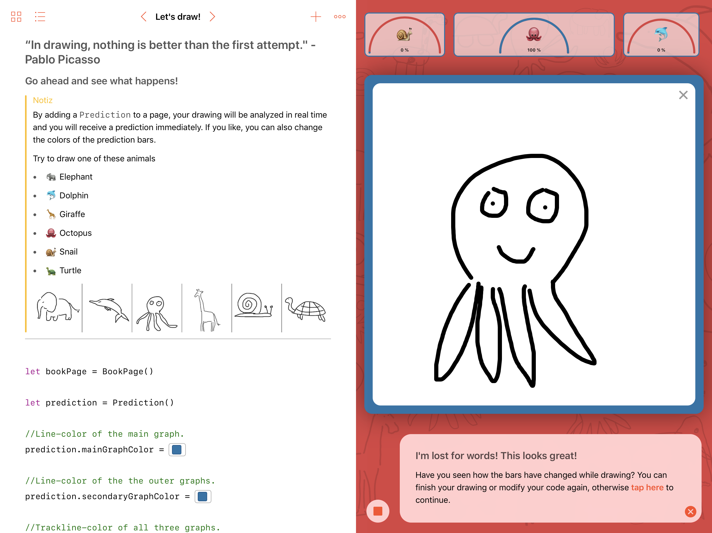
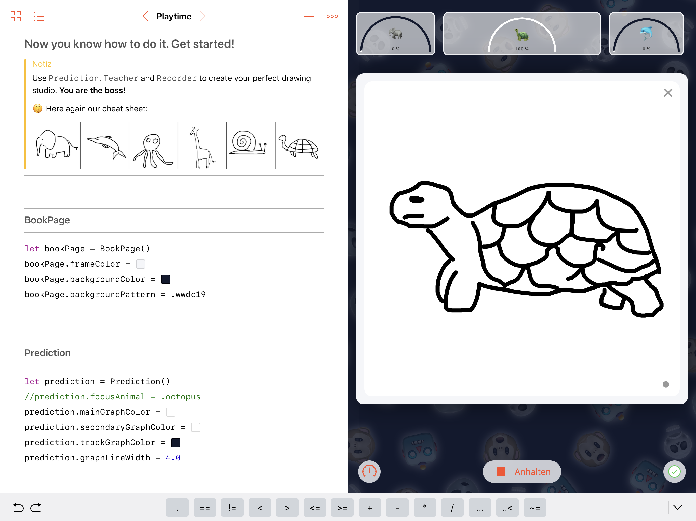

# MLDrawingBook-WWDC19
WWDC19 Scholarship Submission [Accepted]

The most important element of this project is <b>Core ML 2</b>. I created, trained and enhanced my ML Model using the MLImageClassifierBuilder as well as over 250 hand drawn images of different animals I recorded on my iPad.

Enjoy :)

[View on YouTube](https://youtu.be/uOvFMMD5H1w)

### Screenshots

